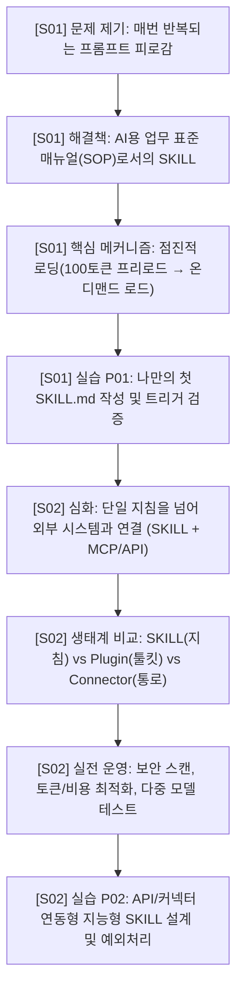

---
kind: slidev-course-brief
schema_version: 1
status: ready-for-build
scope: course
workflow_stage: plan-first
asset_state: planned
course_id: "agent-skill-mastery-2h"
title: "AI 에이전트 업무 매뉴얼: SKILL 설계부터 MCP·엔터프라이즈 운영까지"
thesis: "SKILL은 AI 에이전트에게 반복 업무를 가르치는 표준 지침 패키지이며, 점진적 로딩과 도구 연동을 통해 토큰 효율성과 업무 자동화를 동시에 달성한다."
language: ko
audience: "AI 에이전트(Claude Code, Antigravity, Cursor 등)를 실무에 도입하거나 반복 업무를 자동화하려는 기획자, 개발자, 엔지니어 및 테크 리드"
session_count: 2
session_duration_minutes: 50
total_duration_minutes: 100
delivery: live
practice_in_slides: required
assessment: none-by-default
teacher_guide: separate
learner_handout: separate
next_skill: "$nekomeowww-slidev-deck"
source_count: 1
asset_count: 0
asset_slot_count: 8
---

# Course Brief: AI 에이전트 SKILL 2시간 마스터 코스

## 1. Handoff summary

- **Course Thesis:** SKILL은 AI 에이전트에게 매번 반복 프롬프트를 입력할 필요 없이 점진적 로딩(Progressive Disclosure)으로 필요한 순간에만 로드되어 동작하는 표준 업무 매뉴얼(SOP)이자 자동화 아키텍처이다.
- **Audience Outcome:** 수강생은 SKILL의 기본 원리와 동작 메커니즘을 이해하고, 규격화된 `SKILL.md`를 직접 작성하며, MCP 커넥터 및 플러그인과 연계된 확장형 에이전트 워크플로우를 설계·운영할 수 있다.
- **Narrative Shape:** 
  - **Session 1 (50분):** [기초 및 설계] SOP 비유 → 점진적 로딩 메커니즘 → `SKILL.md` 구조 및 명명 규칙 → [실습 P01] 기본 `SKILL.md` 작성
  - **Session 2 (50분):** [확장 및 운영] SKILL vs Plugin vs MCP 아키텍처 → 외부 API 연동 패턴 → 모니터링/보안/비용 최적화 → [실습 P02] 확장형 SKILL 작성 및 리뷰
- **Asset Strategy:** Plan-first 모드로 8개의 `AST-TBD-*` 슬롯을 지정함. 별도 `asset-acquisition-plan.md`를 통해 SVG 다이어그램 및 UI 캡처 가이드를 수립.
- **Next Action:** 세션별 기획서(`sessions/S01-deck-brief.md`, `sessions/S02-deck-brief.md`)를 기반으로 `$nekomeowww-slidev-deck`을 통해 슬라이드 코딩 진행.

---

## 2. Course Build contract

- **Course Title:** AI 에이전트 업무 매뉴얼: SKILL 설계부터 MCP·엔터프라이즈 운영까지
- **Target Audience:** 개발자, 업무 자동화 담당자, AI 도구 파워유저
- **Prerequisites:** Markdown 기본 문법 이해, AI 프롬프트 사용 경험 (Claude/ChatGPT 등)
- **Structure:** 총 2개 세션 (각 50분, 이론 35분 + 인-슬라이드 실습 15분, 총 100~120분)
- **Language & Tone:** 한국어, 전문적이면서도 직관적인 핸즈온 테크 톤
- **House Style:** nekomeowww 다크 글래스모피즘 (`layout: center/default/intro`, 순백 고대비 텍스트, 네온 시안/에메랄드 포인트 액센트)
- **Strict Scope Boundary:** 강사 대본(Teacher Guide), 학생용 배포 유인물(Handout), 퀴즈/과제 평가 루브릭은 본 기획 범위에서 제외하며 슬라이드 내 포함된 실습(In-Slide Practice)으로 완결.

---

## 3. Session Index

| Session ID | Brief path | Title | Outcome | Prerequisites | Duration | Source IDs | Asset Slots | Status |
| --- | --- | --- | --- | --- | --- | --- | --- | --- |
| **S01** | `sessions/S01-deck-brief.md` | SKILL의 기초 원리와 설계 실습 | SKILL 개념 정의, 점진적 로딩 원리 이해, 첫 `SKILL.md` 작성 및 테스트 | 기본 마크다운 | 50 min | SRC-01 | AST-TBD-01 ~ AST-TBD-04 | ready-for-build |
| **S02** | `sessions/S02-deck-brief.md` | 플러그인·MCP 연동 및 엔터프라이즈 운영 | SKILL vs Plugin 비교, 커넥터 아키텍처, 보안/비용 관리 및 확장형 스킬 설계 | S01 이수 | 50 min | SRC-01 | AST-TBD-05 ~ AST-TBD-08 | ready-for-build |

---

## 4. Course-Level Narrative Spine & Progression

### Progression & Anti-Repetition Rules
1. **S01**에서는 단일 파일(`SKILL.md`) 작성법, `name`/`description` 최적화, 자유도(Freedom level)에 따른 프롬프트 구성에 집중하며, 외부 시스템 인증이나 API 호출은 다루지 않는다.
2. **S02**에서 비로소 MCP(Model Context Protocol), `plugin.json`, 다중 에이전트 병렬 실행, 보안 및 비용 관리 지표를 다루어 중복 학습을 방지한다.
3. 반복 개념(예: YAML frontmatter 형식)은 S02에서 재설명하지 않고 바로 응용 단계로 진입한다.

---

## 5. Source Register

| ID | Type | Original path / URL | Title / Author | Relevant sections | What it supports | Extraction method | Confidence | Rights / privacy |
| --- | --- | --- | --- | --- | --- | --- | --- | --- |
| **SRC-01** | Local Markdown | `C:\Users\IN\Desktop\두견\스킬강의\deep-research-report.md` | SKILL(스킬) 심층 분석 보고서 | 1~8장 전반 | SKILL 정의, 역사, Progressive Disclosure, 제작 가이드, Plugin 비교, 아키텍처, 교안 타임라인 | 직접 분석 및 구조화 | confirmed | 사내 리서치 자료 |

---

## 6. Course-Level Questions, Assumptions, and Risks

- **[P1 Assumption] 실습 환경:** 수강생이 로컬 텍스트 에디터(VS Code, Cursor, Antigravity 등) 또는 Claude Web 환경에서 Markdown을 편집할 수 있다고 가정.
- **[P1 Fallback] API 연동 실습:** S02 실습 시 실제 유료 API 키 발급이 어려운 수강생을 위해 Mocking된 입출력 예시 및 YAML 지침 작성 중심의 Fallback 제공.
- **[P2 Polish] 슬라이드 테마:** nekomeowww 퓨어 블랙 무대와 네온 시안 액센트를 기본 적용하여 가독성과 몰입도 극대화.

---

## 7. Course Handoff

- **Status:** `ready-for-build`
- **Next Action:** 각 세션별 상세 기획서(`sessions/S01-deck-brief.md`, `sessions/S02-deck-brief.md`)를 개별적으로 `$nekomeowww-slidev-deck`에 전달하여 구현.
- **Asset Plan:** `asset-acquisition-plan.md` 참조.
