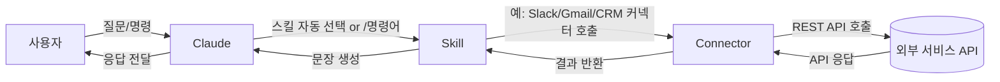

# SKILL(스킬) 심층 분석 보고서

**Executive Summary:** SKILL은 AI 에이전트에게 특정 작업 수행법을 **지침 파일** 형태로 가르치는 개념으로, 각 스킬은 `SKILL.md` 파일(앞부분에 `name`, `description` 작성)과 마크다운 지침, 선택적 스크립트, 리소스 등을 담은 폴더이다. 2025년 10월 도입되어 12월에 오픈 표준으로 발표되었으며, Claude Code/AI, Claude API, OpenAI Codex 등 다양한 플랫폼에서 지원한다. 스킬은 점진적 로딩 방식을 사용하여 성능 최적화를 꾀하는데, 세션 시작 시 이름과 설명만 로드하고, 필요할 때 전체 지침을 불러와 Claude의 컨텍스트 창을 효율적으로 사용한다. 본 보고서에서는 SKILL의 개념과 역사, 주요 구성요소와 아키텍처를 정리하고, 설계 원칙 및 단계별 제작 가이드, 산업별 활용 사례, 플러그인 대비 특장점, 통합 패턴, 운영·보안·비용 관리 전략, 비전문가용 쉬운 설명과 체크리스트를 포함한 2시간 수업용 교안(학습목표, 타임라인, 실습 과제 등)을 상세히 다룬다.

## 1. SKILL의 정의와 개념 
SKILL(스킬)은 AI 에이전트에게 특정 **반복 업무**를 수행하는 방법을 가르치는 **지침 패키지**이다. Anthropic 공식 문서에 따르면 “스킬은 Claude가 특정 작업에서 성능을 향상시키기 위해 동적으로 로드하는 지침, 스크립트, 리소스가 담긴 폴더”로 정의된다. 즉, 각 스킬은 `SKILL.md` 파일(맨 앞 YAML frontmatter에 `name`·`description` 명시)과 본문 지침, 필요시 함께 동작할 스크립트나 참조 문서를 포함한 폴더 구조를 가진다. 예를 들어, 다음 그림은 SKILL.md의 예시 구조로, 이름(name)과 설명(description)이 상단 YAML에 정의되고, 본문에 실행 절차와 예시를 담고 있음을 보여준다. 

 *그림: SKILL.md 작성 예시 (앞부분에 name/description을 정의하고, 절차가 마크다운으로 기술됨).*

스킬은 **점진적 로딩**(progressive disclosure)을 사용한다. 세션 초기에 Claude는 모든 스킬의 이름(name)과 설명(description)만 미리 로드하며(대략 스킬당 100토큰), 사용자가 관련된 작업을 요청하면 해당 스킬의 전체 내용(Skill.md 본문과 연관 리소스)을 비로소 로드한다. 이렇게 하면 수백 개의 스킬을 동시에 활성화해도 컨텍스트 창이 넘치지 않고, 필요할 때만 관련 정보가 호출된다.

SKILL의 역사와 생태계를 보면, Anthropic은 2025년 10월에 스킬 형식을 도입하고 같은 해 12월에 Agent Skills 표준을 발표했다. 이 표준은 Claude뿐만 아니라 OpenAI Codex, 쿠키버터(Cursor), 구글 Gemini CLI 등 다양한 AI 플랫폼에서 지원되며, 개발자들이 플랫폼 간에 재사용 가능한 스킬을 공유하도록 설계되었다. 스킬 생태계에는 Anthropic 공식 스킬 저장소가 포함되어 있으며, 파트너사(예: Notion, Figma, Atlassian 등)도 자체 스킬을 제공해 도구와 연계된 워크플로우를 강화하고 있다. 

## 2. 우수한 SKILL 설계 원칙 및 제작 가이드 
스킬을 효과적으로 설계·개발하기 위해 다음 원칙과 단계를 따르면 된다.

- **요구분석:** 먼저 조직 내 반복되는 업무나 도메인 지식을 파악한다. 예를 들어, 이메일 분류, 보고서 작성, 코드 리뷰 등 어떤 작업을 자동화할지 명확히 정의한다. 이 단계에서 스킬의 목표와 성공 기준을 정리하고, 필요한 데이터(문서, API 연동 대상 등)를 확인한다.

- **스킬 설계:**  
  - **이름(name):** 가능한 구체적이고 동사 형태의 현재분사(gerund)로 작성한다(e.g. `processing-pdfs`, `analyzing-data`). 이름은 소문자·숫자·하이픈만 허용되며, 64자 이하로 간결하게 짓는다.  
  - **설명(description):** 한 문장 내에 스킬이 무엇을 하는지와 언제 사용할지 명확히 기술한다. 예를 들어 “PDF 파일에서 텍스트와 테이블을 추출하고, 양식을 작성합니다. PDF나 문서 추출이 필요할 때 사용하세요.” 등으로, 관련 키워드를 포함하여 Claude가 자동으로 스킬을 찾을 수 있게 한다.  
  - **단계별 절차:** SKILL.md 본문에 구체적인 처리 절차를 단계별로 나열한다. 작업이 자유도(high/medium/low freedom)에 따라 설명의 구체성이 달라진다. 예를 들어, **높은 자유도** 작업(코드 리뷰, 창의적 문서 작성 등)은 “문제를 분석하고 최적의 솔루션을 제안한다”처럼 일반적 지침을 제시하고, **낮은 자유도** 작업(데이터베이스 마이그레이션 등)은 스크립트 명령어까지 구체적으로 제공한다.  
  - **보조 파일:** 필요한 경우, `scripts/` 폴더에 실행 스크립트나 `references/` 폴더에 관련 자료를 두어 스킬 본문에서 참조하게 한다. 예컨대 Python 또는 Bash 스크립트를 포함해 반복 작업을 자동화할 수 있다.

- **개발:** 위 설계에 따라 SKILL.md와 추가 파일을 작성한다. 작성 시 **간결함**을 유지하고 불필요한 배경 설명을 줄인다. 오류 처리 절차, 예제, 검증 단계도 문서에 포함시키고, 필요한 패키지 명세를 기술한다. 모든 파일 경로는 슬래시(`/`)를 사용하고, 보안상 민감한 정보나 `voodoo constants`는 포함하지 않는다.

- **테스트:** 스킬은 사용하는 Claude 모델(Haiku, Sonnet, Opus 등)마다 다르게 동작할 수 있으므로, **모든 대상 모델**로 테스트한다. 실제 시나리오를 기반으로 3개 이상의 예제를 만들어 실행해보고, 출력의 일관성과 신뢰성을 검증한다. 테스트를 통해 트리거(설명)를 조정하고, 결과가 부정확하면 지침을 수정하거나 예외 처리 로직을 강화한다.

- **배포 및 버전관리:** 개발이 완료되면 내부 공유 또는 마켓플레이스 등록을 검토한다. 조직 내 스킬 디렉토리에 추가하거나, Claude Code의 플러그인 형태로 배포하여 조직원이 설치하도록 할 수 있다. 플러그인으로 묶을 경우 `plugin.json`에 이름과 버전을 명시해야 하며, Git 등의 버전 관리 시스템에 소스 전체를 저장한다. 마켓플레이스 등록 시에는 안정성 검사(스캔)를 수행하며, 변경 사항을 반영해 버전을 업데이트한다. 

아래 **제작 체크리스트** 표는 스킬 제작의 각 단계에서 검토해야 할 항목을 정리한 것이다. 

| 단계   | 주요 검토 사항                                             |
|--------|-------------------------------------------------------|
| 요구분석 | - 자동화할 작업과 기대 산출물 정의<br>- 필요 데이터와 권한 확인 |
| 설계    | - **이름·설명** 작성 (구체적이고 일관된 명명)<br>- 사용자/시스템 역할, 성공 기준 설정<br>- 필수 도구·스택 확인 (MCP 커넥터 등) |
| 개발    | - `SKILL.md`에 단계별 절차 작성<br>- 입력/출력 예시 포함<br>- 스크립트/리소스 파일 준비<br>- 오류 처리 루틴과 검증 단계 추가 |
| 테스트  | - 각 Claude 모델(Haiku/Sonnet/Opus)에서 테스트<br>- 최소 3개 평가 시나리오 검증<br>- 설명 수정으로 트리거 최적화<br>- 팀 피드백 반영 |
| 배포    | - 내부 디렉토리 또는 플러그인으로 공유<br>- 플러그인일 경우 `plugin.json` 설정 (이름,버전)<br>- 릴리즈 버전 태깅 및 문서화 |
| 운영    | - 사용 현황(활성·비활성) 모니터링<br>- 정기적 리뷰 및 업데이트<br>- 스킬 스캐닝/보안 검사 설정 |

## 3. 활용 사례 및 실제 업무 적용
SKILL은 다양한 산업과 업무 분야에서 자동화와 효율화를 지원한다. 주요 사례는 다음과 같다:

- **고객지원:** 예를 들어, 이메일 헬프데스크를 자동화하는 ‘Customer Support Agent’ 스킬은 지원 메일을 분류해 Google 시트에 티켓을 기록하고, 긴급 이슈를 채팅 채널로 에스컬레이션한다. 이 스킬을 통해 “고객 문의를 티켓으로 등록해줘” 같은 명령만으로도 Claude가 관련 레이블, 참조 문서를 찾아 적절한 티켓을 생성할 수 있다.  

- **영업 및 마케팅:** Salesforce 플러그인(Claudeforce)을 통해 영업 데이터를 통합하면, 판매 담당자는 Claude로 “금월 거래 예측 보고서 만들어줘”와 같이 요청해 실시간 매출 데이터를 분석하고, 자동으로 견적서를 생성할 수 있다. 예를 들어 **37개의 사전 제작된 스킬**이 포함된 Claudeforce 플러그인을 통해 파이프라인 갱신, 계정 계획 작성 등이 가능하다.  

- **HR 및 인사:** 반복적인 온보딩, 면접 일정 조율 등의 업무에도 활용된다. 예를 들어 “신입사원 *의 30일 온보딩 플랜을 작성해줘”라는 명령으로 스킬이 회사 프로세스와 팀구성 정보를 참조해 맞춤형 온보딩 일정을 작성하도록 할 수 있다. 실제로 30일 온보딩 계획 생성 스킬을 만드는 워크샵(LinkedIn 사례)이 진행되었으며, AIHR에서 Claude를 활용한 HR 프로세스를 테스트하기도 했다.  

- **개발자 도구:** 코드 리뷰, PR 검토, 이슈 관리 등 개발 업무를 자동화하는 스킬들이 늘고 있다. 예를 들어 깃허브 풀 리퀘스트를 검사해 코드 규약 준수 여부를 확인하거나 버그를 찾아주는 스킬이 있으며, 여러 에이전트를 병렬 실행해 안전한 수정 제안을 하는 플러그인도 존재한다. 또한, 자동 릴리즈 노트 생성, 성능 테스트 스크립트 작성 등 개발 생산성을 높이는 다양한 스킬 예제가 공개되어 있다.

이 외에도 문서작성(계약서, 보고서 자동 생성), 데이터 분석(엑셀/CSV 처리, 시각화), 금융 모델링(리스크 분석), 법무(계약 검토) 등에서 사례가 보고되었다. 예를 들어 계약서 요약 스킬, 노코드 애플리케이션 스킬, 마케팅 콘텐츠 생성 스킬 등이 있다. 산업별로는 금융, 의료, 고객 서비스, 소매업 등에서 빠르게 도입되고 있으며, 엔터프라이즈용 스킬 플러그인을 통해 부서 단위로 특화된 스킬 세트를 활용할 수 있다.

## 4. SKILL vs 플러그인 비교 
SKILL과 플러그인은 Claude 생태계에서 겹치는 개념처럼 보이지만 **역할과 규모**에서 본질적인 차이가 있다. 아래 표는 특성별 차이를 정리한 것이다.

| 특성          | SKILL (스킬)                                      | Plugin (플러그인)                                       |
|--------------|--------------------------------------------------|--------------------------------------------------------|
| **정의 및 용도** | 단일 업무를 수행하도록 Claude에 지시하는 **지침 패키지**. 특정 작업 처리 방법(절차·규칙)을 제공. | 여러 스킬·커넥터·에이전트를 하나로 묶어 제공하는 **도구 묶음**. 역할별 전체 워크플로우를 사전 구성. |
| **구성 요소**   | `SKILL.md` (name, description), 단계별 지침, 선택적 스크립트/리소스 | `plugin.json` (name, description, version), `.claude-plugin/` 디렉토리에 여러 SKILL.md, 커넥터, 서브에이전트 등 포함 |
| **발견/설치**   | Claude의 스킬 디렉토리에서 설치하거나, 개발자가 직접 `.claude/skills/`에 추가 | Claude 플러그인 마켓플레이스에서 검색/설치. 설치 시 관련 스킬과 커넥터가 자동 활성화 |
| **배포 및 관리** | 조직 공유용 스킬 디렉토리(Claude 코드팀 기능) 또는 개별 공유. 일반적으로 Git 저장소로 관리 | 마켓플레이스 단위로 배포. 버전 관리(`plugin.json` 버전 필드) 및 기업 정책(설치 제한, 플러그인 검증) 적용 |
| **실행 맥락**   | Claude 대화 중 필요 시 자동 호출 또는 슬래시 명령어(`/skillName`)로 수동 실행. 한 스킬씩 독립 실행. | 플러그인에 포함된 모든 스킬/커넥터가 통합되어 작동. 설치 후 대화 전역에서 사용 가능. 조직 전체 공유 및 권한 관리를 포함. |
| **외부 연동**   | 주로 앤드포인트 연결은 MCP 커넥터가 담당. 스킬 본문에서 도구 호출 함수나 커넥터로 외부 API 접근. | 자체 커넥터를 포함해 외부 서비스 인증・연결을 설정. 예: Slack, Google Workspace, Salesforce 등 복수의 서비스와 자동 연동 |
| **보안/권한**  | 자체 실행 코드 없이 텍스트 지침 중심. 외부 서비스 접근 시 클라이언트 인증 필요. 민감 정보는 스크립트에 직접 포함하지 않음. | 로컬 MCP 서버 포함 가능(주의 필요), 다양한 권한 설정. 엔터프라이즈 계획에서는 악성 코드 스캔, 플러그인 설치 제한 기능 제공. |
| **개발 생산성** | 단일 업무에 집중된 마크다운으로 빠르게 개발 가능. 코드 개발 부담 적음. | 조직 전반에 걸친 공통 기능을 한번에 제공. 초기 설정은 복잡하지만 팀 전체에 통합 배포 후 재사용성 높음. |
| **비즈니스 관점** | 특정 업무에 특화된 사용자 또는 부서 단위 기능. 맞춤형 스킬 개발로 효율 향상. | 제품화된 솔루션. 파트너사·팀 단위 배포에 유리. 마켓플레이스 수익화나 부서 전역 배포용으로 적합. |

이처럼 **스킬**은 “*협업·지시용 설명서*”라면, **플러그인**은 “*설명서를 담은 툴킷*”이라 할 수 있다. 플러그인은 여러 스킬을 패키지화해 공동설치하고, 필요한 서비스 인증(커넥터)도 포함하여 한 번에 배포할 수 있는 반면, 스킬은 특정 작업 하나를 위한 가이드를 제공한다. 보안 측면에서도 플러그인은 독립 실행 코드(MCP 서버)나 로컬 실행 환경을 포함하므로 설치 전에 악성 여부를 검증하고 사내 정책에 맞게 권한을 제어해야 한다.

## 5. SKILL+플러그인 통합 패턴과 아키텍처 
스킬과 플러그인을 함께 사용할 때의 구현 방법과 통합 패턴을 살펴보자. 주로 **스킬 → API/커넥터 호출** 흐름이 핵심이며, 플러그인은 이 과정을 패키징과 권한 관리의 관점에서 보강한다.

- **API/커넥터 연동:** 스킬에서 외부 시스템과 상호작용하려면 MCP 커넥터나 직접 도구 호출을 사용한다. 예를 들어, “지금 회의록을 Gmail에 이메일로 보내”라는 스킬이라면, 스킬 본문에서 Google Workspace 커넥터를 호출할 수 있다. 커넥터는 OAuth2와 같은 인증을 처리하며, Claude는 이미 인증된 상태에서 API를 호출해 작업을 수행한다. 데이터 흐름은 다음과 같다: 사용자 요청 → Claude → 스킬 선택 → `SKILL.md` 지침 실행 → 커넥터를 통한 외부 API 호출(필요 시 액세스 토큰 사용) → API 응답 → 스킬이 응답으로 처리하여 사용자에게 결과 제공.

- **플러그인 활용:** 플러그인은 커넥터 설정과 스킬 배포를 통합하여 단순화한다. 예컨대 Slack 커넥터와 연관된 스킬 여러 개를 ‘연동형 커뮤니케이션’ 플러그인에 넣으면, 사용자는 플러그인 설치만으로 Slack 인증과 스킬 사용을 동시에 갖출 수 있다. 플러그인 내 `plugin.json`에 필요한 서비스 스콥(scope)이나 환경 변수를 선언해 두면, 스킬에서는 해당 정보를 바로 참조한다. 플러그인의 서브에이전트(sub-agent)를 사용해 더 복잡한 병렬 작업도 자동화할 수 있다. 

아래의 머메이드 다이어그램은 스킬이 플러그인의 커넥터를 이용해 외부 API와 통신하는 전형적인 아키텍처를 보여준다. 예를 들어, ‘문의 파이프라인 업데이트’ 스킬이 Salesforce API를 호출하여 영업 데이터를 조회하는 시나리오이다. 



이와 같이 **스킬**은 핵심 로직(무엇을 어떻게 할지)을 기술하고, **커넥터(API)**가 외부 데이터를 주고받는 다리 역할을 한다. 플러그인은 이 과정을 구성·관리하고 인증을 처리함으로써 개발자와 사용자가 개별 스킬과 커넥터를 손쉽게 조합하여 사용할 수 있게 해준다.

## 6. 관리·운영·모니터링·보안·성능·비용 전략과 인사이트 
SKILL과 플러그인을 대규모 시스템에 적용할 때에는 다양한 운영 및 보안 고려사항이 따른다.

- **관리·운영:** 스킬은 “문서” 형태이므로 각 스킬의 변경 내역과 담당자를 명확히 관리해야 한다. 예를 들어 스킬 변경 시 버전을 태깅하고, 조직 내 스킬 디렉토리나 플러그인 업데이트 정책에 따라 검토한다. 운영 중에는 스킬 활성화(켜기/끄기)나 플러그인 설치 가능 여부를 조직 설정에서 통제하며, 필요 시 조직 전용 스킬 저장소(마켓플레이스)를 운영한다.

- **모니터링:** 스킬 사용량, 성공률, 오류율, 지연 시간 등의 지표를 수집한다. 예를 들어 하루에 얼마나 많은 세션에서 특정 스킬이 호출되었는지, 스킬의 평균 응답 시간, 실패한 API 호출 건수 등을 로깅한다. 아래 표는 대표적인 모니터링 지표 예시다.

  | 지표 유형        | 설명                                                   |
  |---------------|------------------------------------------------------|
  | 사용/활성화   | 일별/월별 스킬 호출 횟수, 활성화된 스킬 수                                  |
  | 성능         | 평균 응답 시간(ms), 최대/최소 응답 시간                                |
  | 성공률        | 스킬 실행 성공 비율, 외부 API 호출 성공률 (e.g. 200 응답 비율)          |
  | 오류         | 스킬 실행 중 발생한 오류 수(예: 코드 에러, API 타임아웃), 사용자 피드백 건수 |
  | 자원사용/비용 | 토큰 사용량(모델별 토큰 수), API 호출량 및 비용                            |
  | 보안 이벤트    | 인증 실패, 권한 위반 시도, 플러그인 스캔 위험 경고 수                       |

  이 지표를 이용해 품질 문제를 조기에 파악하고, 예를 들어 응답 지연이 증가할 경우 모델 크기 조정이나 스크립트 최적화를 고려한다.

- **보안:** 스킬 및 플러그인은 신뢰할 수 있는 소스만 설치해야 한다. 엔터프라이즈 플랜에서는 **스킬·플러그인 스캐닝** 기능을 통해 악성 코드를 검사하며, 위험 요소가 발견되면 경고가 뜨고 차단할 수 있다. 스킬 안에 API 키나 비밀번호를 직접 넣지 않고, 환경변수나 시크릿 매니저를 사용해 비밀 정보를 분리 보관한다. 외부 커넥터를 사용할 때는 최소 권한 원칙을 적용하여 필요한 스코프만 부여해야 한다. 예를 들어, Google 커넥터는 읽기 전용 권한만 부여하고, 쓰기가 필요한 경우 별도 검토를 거친다. 또한, 스킬의 출력으로 개인 정보나 민감 데이터를 다룰 경우 데이터 암호화/익명화를 검토한다.

- **성능 최적화:** 스킬 지침은 가능한 한 간결하게 작성하여 모델의 처리 부하를 줄인다. 필요 없는 예시나 배경 정보를 제거하고, 조건부 절차로 분기하여 Claude의 추론 비용을 최적화한다. 예를 들어 워크플로우가 불필요하게 길어지지 않도록 단계별 핵심만 포함하고, 반복 작업은 스크립트로 위임한다. 멀티모델 사용 시 Haiku·Sonnet·Opus 별로 튜닝이 필요하며, 저사양 모델에서는 더 많은 구체성이 필요할 수 있다.

- **비용 관리:** Claude API나 Cowork 사용량에 따른 비용을 관리해야 한다. 사용량이 많은 스킬은 고정 문서화하여 반복 호출을 줄이고, 적절한 토큰 제한을 설정한다. 가능하면 호출 빈도가 높은 부분은 플러그인 내부에서 로컬로 처리하거나 배치 작업으로 전환하여 실시간 요금 부하를 완화할 수 있다. 또한, 사용자가 불필요하게 스킬을 오남용하지 않도록 권한을 분리하고, 필요한 경우 쿼터를 설정한다.

- **컴플라이언스 및 리스크:** 모든 스킬/플러그인은 조직의 보안 정책과 규제를 준수해야 한다. 예를 들어 GDPR이 적용되는 데이터는 EU 리전에만 저장되고 처리되도록 하고, 금융회사는 PCI-DSS 요구 사항을 고려해야 한다. 실패 사례로는 스킬 설명이 불명확해 Claude가 잘못된 스킬을 선택하거나, 스크립트 에러로 스킬이 아예 동작하지 않는 경우가 있다. 이를 회피하려면 스킬 설명에 키워드를 추가해 과/오탐을 줄이고, 중요 작업에는 복수 평가(evaluation)를 사전에 만들어 두어 정확도를 검증한다.

위험 요소 요약:
- **과도한 호출:** 무분별하게 많은 API 호출로 쿼터 초과·비용 폭증. → 호출 제한 및 캐싱으로 방지.  
- **허위/부정확 출력:** 부정확한 결과로 잘못된 의사결정. → 평가데이터로 검증, 피드백 루프 구현.  
- **권한 남용:** 필요한 권한 이상 부여 시 데이터 유출 위험. → 최소 권한 원칙, 보안 감사.  
- **외부 스크립트 취약점:** 포함된 코드에 취약점 발생. → 정적 분석, 패키지 업데이트.  

## 7. 비전문가 설명 및 체크리스트
스킬 기술의 주요 개념을 비전문가도 이해하기 쉽게 정리하면 다음과 같다. “SKILL은 **Claude용 업무 매뉴얼**”이라고 생각할 수 있다. 예를 들어 **고객지원** 스킬을 만든다면, “고객 문의가 오면 어떻게 처리할지 순서대로 적어놓은 절차서”라고 보면 된다. 일단 한 번 작성해두면 Claude가 이를 기억하고 같은 업무에 적용하므로, 매번 같은 지시를 반복해서 입력할 필요가 없다.  

- **쉬운 비유:** 스킬은 조직의 **SOP**(표준 업무 절차서)와 비슷하다.  정보가 필요할 때마다 일일이 설명할 필요 없이, SOP를 참고하듯 Claude가 스킬을 읽고 그에 따라 행동한다. 플러그인은 그 SOP 묶음을 온라인으로 공유하는 “공유 라이브러리”라고 보면 된다.  

- **체크리스트:** 스킬을 만들 때 아래 사항을 체크하자:  
  - 스킬 폴더와 `SKILL.md` 파일을 생성했다.  
  - `name`과 `description`을 빠짐없이 작성했다. (스킬 이름으로 무엇을 하는지, 설명에 언제 쓰는지 명시)  
  - 설명 텍스트가 명확한지 확인했다 (주어/조사 빼고, 3인칭으로 기술).  
  - 마크다운 절차를 단계별로 나눠 작성했다. 예시 명령과 출력 예제를 포함했는가?  
  - 필수 스크립트나 라이브러리를 첨부했고, 파일 경로를 올바르게 작성했다. (경로는 `/` 사용)  
  - 테스트를 거쳐 Claude가 스킬을 잘 선택하고 예상 답변을 내는지 확인했다.  
  - 버전 관리를 위해 Git에 올려두었다. (변경사항 커밋, 릴리즈 노트 작성)  
  - 보안 점검을 완료했다 (API 키는 환경변수 등으로 분리, 커넥터 인증 정상).  

이러한 준비 과정을 따르면, 기술적 전문 지식이 많지 않아도 스킬 개발에 접근할 수 있다. 예를 들어 문서 작성 업무를 자동화하려면, “회사 템플릿을 불러와서 고객 제안서를 만들어줘” 같은 간단한 자연어 지시를 스킬 단계로 풀어 기술하면 된다. SKILL을 일단 만들면 Claude는 이를 스스로 실행하므로, 사용자는 더 빠르고 정확하게 업무를 처리할 수 있다. 

## 8. 교육용 2시간 수업 교안

**학습목표:** 수업 완료 후 학생들은 SKILL의 개념과 차별점, 설계·개발 과정을 이해하고, 실제 업무 사례를 통해 스킬을 설계·구현해볼 수 있다. 주요 목표는  
1) SKILL과 플러그인의 개념과 차이점을 설명할 수 있다.  
2) SKILL 설계 원칙(이름·설명 작성, 단계적 절차 기술 등)을 적용할 수 있다.  
3) 간단한 SKILL.md를 작성하고, 외부 API와 연동해보는 실습을 완수할 수 있다.  

### 시간배분 및 세부내용

```mermaid
gantt
  title 2시간 수업 타임라인
  dateFormat  HH:mm
  axisFormat  %H:%M
  section 도입
    강의 목표 및 개요 설명      :done, 09:00, 09:10
    SKILL 개념 정의            : 09:10, 09:20
  section 심화 학습
    SKILL 설계 원칙 (명명, 설명) : 09:20, 09:35
    단계별 제작 과정 (개발/테스트)  : 09:35, 09:50
    실습 과제 안내 및 준비        : 09:50, 10:00
  section 실습
    실습1: SKILL.md 작성        : 10:00, 10:20
    실습2: 커넥터 연동 응용      : 10:20, 10:40
  section 정리
    결과 공유 및 Q&A           : 10:40, 10:50
    평가 방법 안내 및 과제 부여   : 10:50, 11:00
```

- **도입 (0~10분):** 수업 목표와 전체 개요를 설명한다. 간단히 AI 에이전트와 자동화의 트렌드를 소개한 후, SKILL의 개념을 정의한다. *예:* “SKILL은 Claude를 위한 사용자 맞춤형 업무 매뉴얼입니다.”.

- **SKILL 설계 원칙 (10~35분):** SKILL의 구조와 작성법을 설명한다. 이름(name)·설명(description) 작성법과 YAML frontmatter 예시를 보여준다. 단계별 지침 작성 방법과 자유도에 따른 기술 양 조절을 설명한다. 설계 체크리스트를 제시한다. (위 표의 내용을 중심으로 강의)

- **단계별 제작 과정 (35~50분):** 실제 스킬 개발 절차를 시연한다. 예를 들어 **문서 작성 스킬** 예제를 보여주며 `SKILL.md` 파일을 작성한다. 오류 처리, 테스트 예시를 설명하고, 모델별 검증 필요성을 강조한다.

- **실습 과제 안내 (50~60분):** 두 가지 실습 과제를 소개하고 준비를 안내한다. 목표와 평가 기준을 명확히 한다.

- **실습 1 (60~80분):** 난이도 *하* 과제로, 제공된 템플릿에 따라 간단한 `SKILL.md`를 직접 작성해본다. 예를 들어 “영어 이메일을 정중한 형식으로 바꿔줘” 스킬을 주제로, `name`, `description`과 간단한 변환 지시를 작성해보게 한다.

- **실습 2 (80~100분):** 난이도 *상* 과제로, 외부 API 연동을 포함한 스킬을 구현한다. 예를 들어 “회신 템플릿을 설문으로 Google Forms에 등록해줘” 과제로, Google Forms 커넥터를 호출하는 스크립트를 스킬에 추가해본다. 학생들은 플러그인을 통한 인증 과정을 거치고, API 호출 결과를 확인한다.

- **정리 및 평가 (100~120분):** 학생들이 완성한 스킬을 공유하고, 피드백을 제공한다. 질의응답 시간을 갖고 주요 학습 포인트를 요약한다. 과제로 추가적인 스킬 아이디어를 제출하도록 안내한다. 평가 방법으로는 실습 산출물(코드 리뷰)과 퀴즈를 병행할 수 있다. 평가 기준은 스킬 구성의 완성도(명칭·설명 적절성, 단계 기술 여부), 기능 구현 여부, 보안·예외 처리 포함 여부 등이다.

**실습 과제 예시:**  
1) *기초 과제:* 주어진 `SKILL.md` 템플릿에 따라 “할 일 목록 정리” 스킬을 작성하시오. (설명은 한국어, 출력 예시 포함)  
2) *응용 과제:* 파이썬 스크립트나 커넥터를 활용하여, 작성한 스킬을 실제 외부 서비스(Google Sheet, Slack 등)와 연동하도록 확장하시오.  

### 참고자료 및 심화 학습
- Anthropic 공식 문서 “Skills Overview” 및 “Best Practices”  
- Claude 스킬 개발 가이드 (개발자 블로그/매뉴얼)  
- ComposioHQ “Awesome Claude Skills” GitHub  
- Claudeforce(Salesforce+Claude) 소개 페이지  
- MCP Market 사례(고객지원 에이전시 스킬)  

*모든 내용과 사례는 Anthropic 공식 문서 및 업계 실제 사용 사례를 기반으로 재구성되었으며, 최신 자료를 바탕으로 작성되었다.*